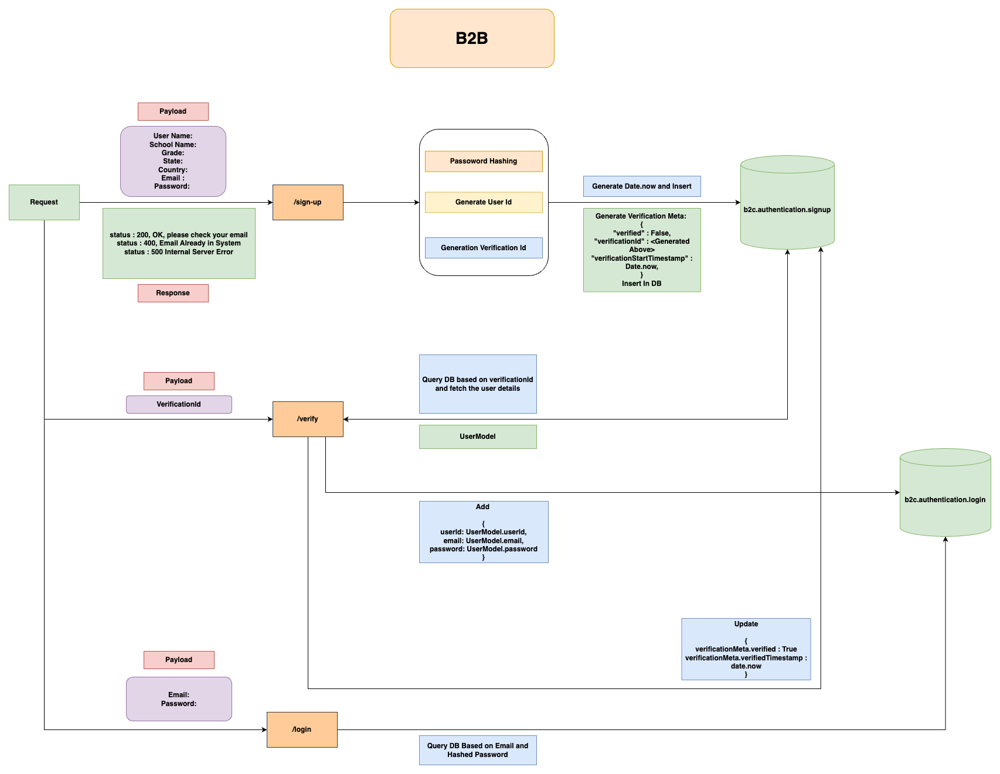
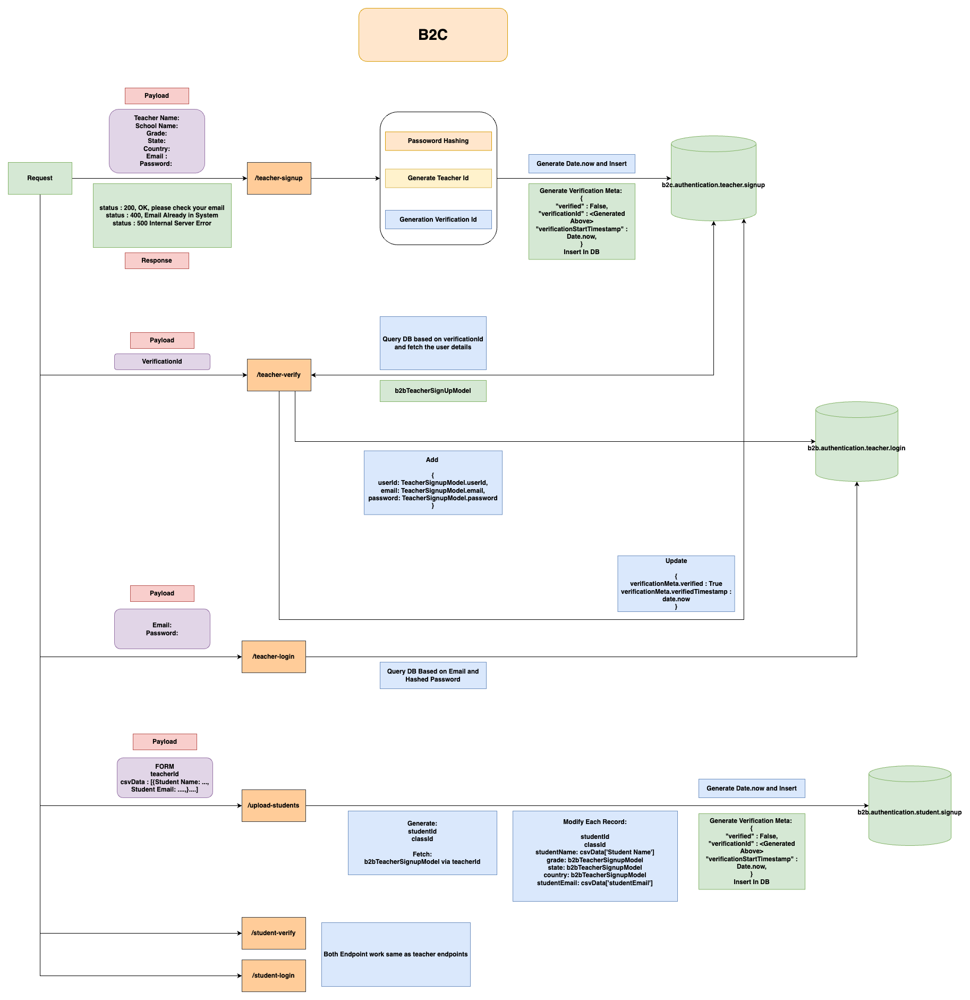

# B2B and B2C Login, SignUp, Verfication Service

Explaining directory structure.

- `configs/` : This directory contains all the configuration for the current setup.

  - Make sure to create a `.env` file and with following lines and save it in `configs` directory.
    ```
        MONGO_CONNECTION_STRING = ""
        BCRYPT_SALT = 10
    ```

- `controllers/` : This directory contains all the vanilla implementation and modifications over the external modules. For examples:

  - `controller.db.js` : This package is implementation over vanilla mongo package.
  - `controller.db.js` : This package is implementation over vanilla winston package, adding customization that suits our current implementation.

- `data/` : This directory contains everything relating to the data work.

  - `data/models/` : This directory contains all the database models. File name gives away the related block: `model.authentication.js` contains all the models relating to authentication router or authentication block.

- `logs/` : This directory contains all the logs generated by `controllers/controller.logger.js` in rotation.

- `routers/` : This directory contains three main components:
  - `router.*.js` : Router entry file for a particular feature.
  - `blogic` : Blogic for each router implementation, in case implementation of `router.*.js` involves multiple logic or gets cumbersome, it can be moved into blogic for sake or clarity or additional layer of business seperation. For `router.*.js` file corrosponding blogic file will be `blogic/blogic.*.js`. For example, blogic file for `router.B2B.Authentication.js` and `router.B2B.Authentication.js` is `blogic/blogic.authentication.js`, ideally there should be two blogic file seperately for `B2B.Authentication` and `B2C.Authentication`, this can be incorporated later on.
  - `middleware/` : Similarly middleware logic are contained in `middleware/middleware.*.js` for corrosponding `router.*.js` file, currently `router.B2B.Authentication.js` and `router.B2C.Authentication.js` both have same `middleware/middleware.authentication.js` as both use this module commonly.
  - `uploads/` : Contains all the uploaded session files.

## B2B Architecture Diagram



## B2C Architecture Diagram


